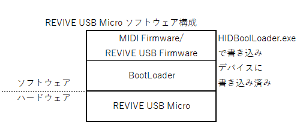
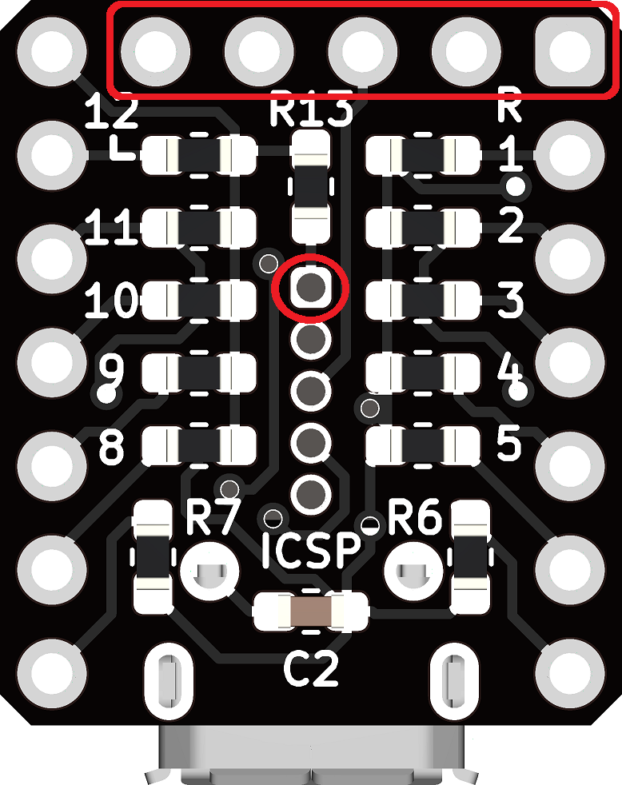
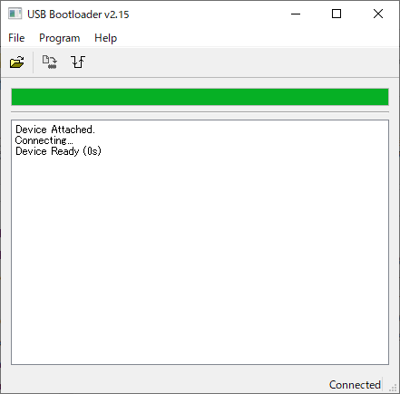
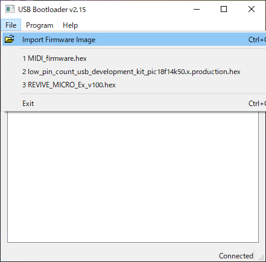
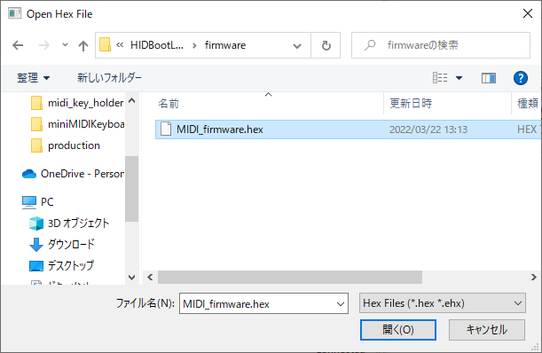
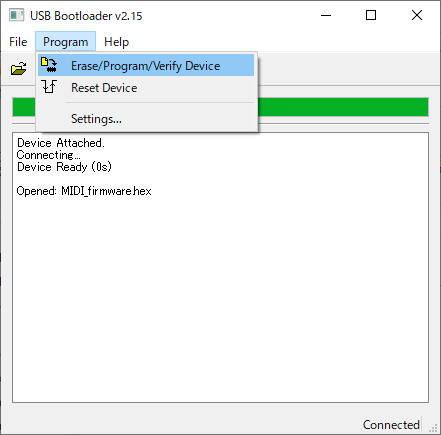
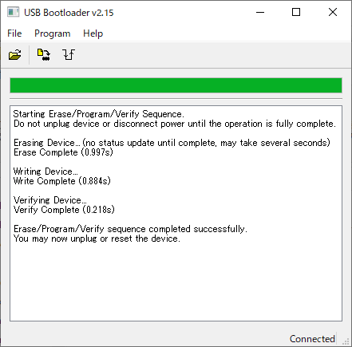

<!-- omit in toc -->
# はじめに
本MIDIファームウェアは、REVIVE USB Microのファームウェアと置き換えることによりREVIVE USBをMIDIの入力デバイスとして使用することができるサンプルソフトウェアです。
小型のMIDI鍵盤や、ボタンやセンサ等と組合わせたMIDI入力デバイス作成時の参考作例としてご利用ください。  

  

<!-- omit in toc -->
# 目次
- [ハードウェア](#ハードウェア)
- [ソフトウェア](#ソフトウェア)
- [仕様](#仕様)
- [MIDIファームウェアの書き込み](#midiファームウェアの書き込み)
  - [BootLoaderモードで立ち上げ](#bootloaderモードで立ち上げ)
  - [ファームウェアの書き込み](#ファームウェアの書き込み)
- [REVIVE USB Microファームウェアの書き戻し](#revive-usb-microファームウェアの書き戻し)
- [開発環境](#開発環境)
  

# ハードウェア
* REVIVE USB Microの各GPIO(P1～P12)とMCLRにタクトスイッチ等を接続します。スイッチONで各GPIOをGNDレベルとすることにより、対応するMIDI信号を送出します。
* P1からP12は、それぞれREVIVE USB Micro基板上のヘッダピンの1～12に対応し、MCLRは、基板裏側のICSP端子の1番ピンに対応します。
* MCLRピンは、ファームウェアの書き込み時にも使用しますので、当該ノートの送出が不要な場合でもタクトスイッチ等を取り付けておくことをお勧めします。
* ケースはアクリル板と3Dプリンタで作成してみました。

  
  
  

# ソフトウェア
REVIVE USB Microに出荷時に書き込まれているファームウェアを本MIDIファームウェアに書き換えることにより、本デバイスをMIDI入力用とすることができます。

  
  

# 仕様 
REVIVE USB Microの各GPIOをGNDレベルとすることにより、下表に示すノート番号を送出します。

| 音名  |ノート番号|GPIO|I/O|
|-----|-----|-----|-----|
|C4|0x3C|P12|RC0|
|D4|0x3e|P11|RC1|
|E4|0x40|P10|RC2|
|F4|0x41|P3|RC3|
|G4|0x43|P2|RC4|
|A4|0x45|P1|RC5|
|B4|0x47|P4|RC6|
|C5|0x48|P5|RC7|
|C#4|0x3d|P9|RB4|
|D#4|0x3f|P8|RB5|
|F#4|0x42|P7|RB6|
|G#4|0x44|P6|RB7|
|A#4|0x46|MCLR|RA3|
 - 送出するMIDIチャネルは"1"固定となります
 - ベロシティは"127"固定となります
 - スイッチオン、スイッチオフで、それぞれ約20msのチャタリング防止期間があります。これより早いキー操作は無視されます。
 - 最大13のノートを（ほぼ）同時に送出できます。
 - 本仕様は予告なく変更することがあります。
  

# MIDIファームウェアの書き込み
## BootLoaderモードで立ち上げ
ファームウェアを更新するためには、デバイスをBootLoaderモードにする必要があります。
デバイスからUSBコネクタを抜き、基板裏側のICSP端子の1番ピン（MCLR端子）をGNDに接続した状態で、USBコネクタを再接続することによりデバイスはBootモードになります。
  

  

## ファームウェアの書き込み
- HIDBootLoader.exeを立ち上げます。
使用できるHIDBootLoader.exeのバージョンは、「mla_v2018_11_26_windows_installer.exe」でインストールされるv2.15が確実です。 
  
 

 - デバイスが認識されると上図の様に「Device attached.」と表示されます。
初めてBOOTモードで接続した時には、自動的にPCにドライバがインストールされます。（１分程時間がかかります）
 

 - 「File」メニューの「Import Firmware Image」を選択します。  
   

 - -書き込みたいHexファイルを選択します。  
    [MIDI_firmware.hex](./firmware/MIDI_firmware.hex)  
  

 - 「Program」メニューから「Erase/Program/Verify Device」を選択します。  
   

 - ソフトが書き込まれます。  
   

 - 「Erase/Program/Verify sequence completed successfully.」が表示されれば書き込み完了です。 
USBケーブルを抜き差しすると、書き込んだソフトが起動します。  

# REVIVE USB Microファームウェアの書き戻し
オリジナルのファームウェアに戻す場合は、[REVIVE USB Micoroのファームウェア](https://github.com/bit-trade-one/ADRVMICR2-REVIVE-USB-Micro-Rev2/tree/master/Firmware/Rev2)を参照してください。  

（注）ファームの書き戻しに使用するHIDBootLoader.exeはバージョンが異なります。必ず指定のバージョンで書込みを行ってください。  

# 開発環境
MIDIファームウェアの開発環境を、以下に示します。

 - MPLABX  
 MPLABX-v6.00-windows-installer.exe
 - XC8  
xc8-v2.36-full-install-windows-x64-installer.exe
 - MLA  
mla_v2018_11_26_windows_installer.exe
